# **Robotics Nanodegree** #

# **Term1 – Project2: Robotic arm - Pick & Place project** #


## **SETUP AND RUN** ##

1-Gazebo check. It should be version 7.7.0+:

```
gazebo --version
sudo sh -c 'echo "deb http://packages.osrfoundation.org/gazebo/ubuntu-stable `lsb_release -cs` main" > /etc/apt/sources.list.d/gazebo-stable.list'
wget http://packages.osrfoundation.org/gazebo.key -O - | sudo apt-key add -
sudo apt-get update
sudo apt-get install gazebo7
gazebo –version
```

2-On TERMINAL:

```
mkdir -p ~/catkin_ws/src
cd ~/catkin_ws/
catkin_make
cd ~/catkin_ws/src
git clone https://github.com/caudaz/RoboND-Kinematics-Project
cd ~/catkin_ws
rosdep install --from-paths src --ignore-src --rosdistro=kinetic -y
cd ~/catkin_ws/src/RoboND-Kinematics-Project/kuka_arm/scripts
sudo chmod +x target_spawn.py
sudo chmod +x IK_server.py
sudo chmod +x safe_spawner.sh
cd ~/catkin_ws
catkin_make
export GAZEBO_MODEL_PATH=~/catkin_ws/src/RoboND-Kinematics-Project/kuka_arm/models
source ~/catkin_ws/devel/setup.bash
cd ~/catkin_ws/src/RoboND-Kinematics-Project/kuka_arm/scripts
./safe_spawner.sh
```

3-On TERMINAL:

```
source ~/catkin_ws/devel/setup.bash
cd ~/catkin_ws/src/RoboND-Kinematics-Project/kuka_arm/scripts
rosrun kuka_arm IK_server.py
```

4-On RVIZ window:

Click on “Next” to move thru actions.


## **INTRODUCTION** ##

This project is modeled after KUKA KR210 Robotic Arm. The purpose is to
implement the inverse kinematics calculations of the system, after being
given the end-effector pose. All the arm angles will be calculated. The
tools used for the project are:

-ROS

-GAZEBO for world physics simulator

-MoveIt for motion planning

-RViz for visualization

The goal of the project is to track the planned trajectory and
successfully complete pick and place operation.


## **KINEMATICS GEOMETRY AND PARAMETERS** ##

All the values for the robot geometry are contained inside the URDF file
divided into 2 XACRO (“XML macro URDF”) files:

1- kr210.gazebo.xacro contains static and dynamic friction coefficient
for the links.

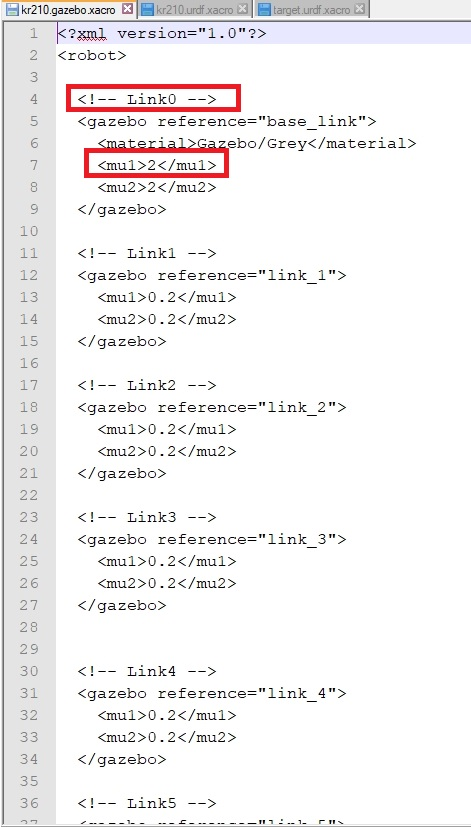

2- kr210.urdf.xacro contains each LINK origin w.r.t to its local C.S.,
mass, inertia tensor, visual representation using a DAE file, and a
collision representation using an STL file.

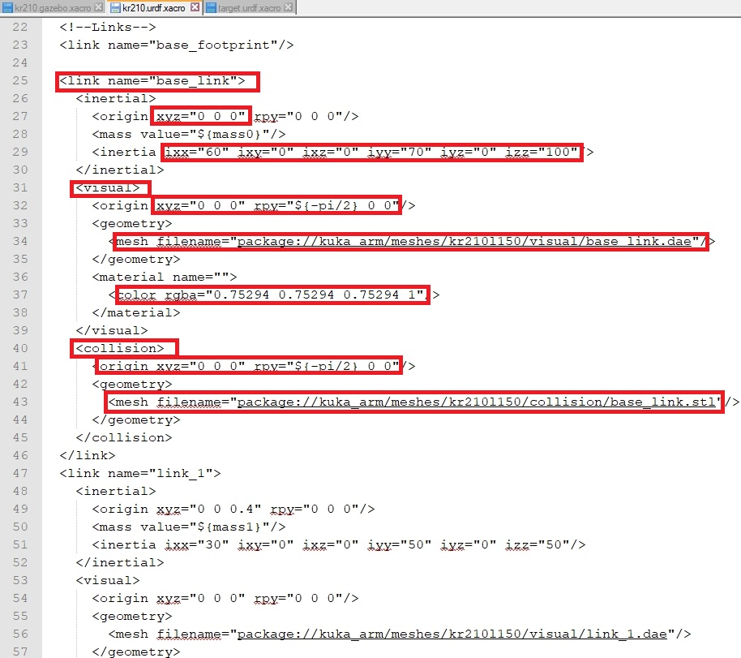

It also contains each JOINT type, origin, parent/child LINK, axis, and
physical limits.

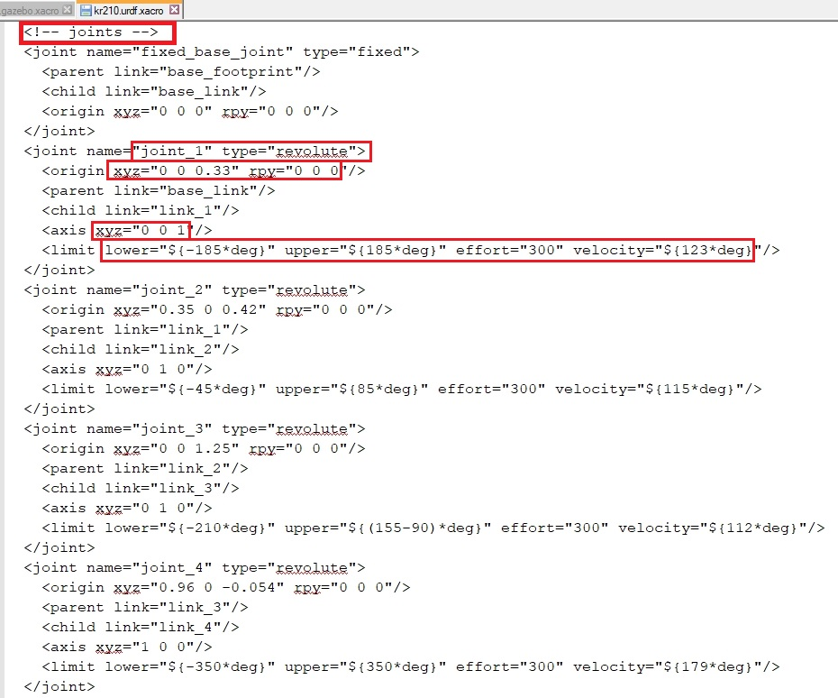

From reading the URDF files, we can get a basic understanding of the
robot kinematic system:


## **Forward kinematics and DH params** ##

The Denavit-Hartenberg (DH) parameters is a method for attaching
reference frames to the links of a manipulator that simplifies the
homogeneous transforms (HT):

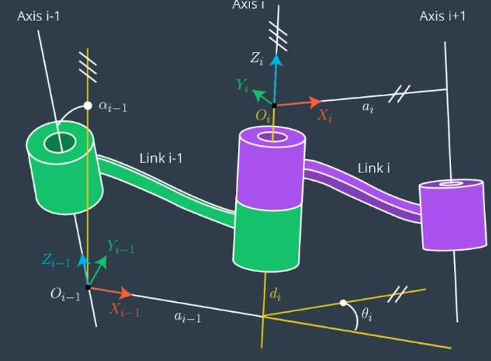

Where:

-**a** is the link **LENGTH**

-**d** is the link **OFFSET**

-**alpha** is **TWIST** angle

-**theta** is **JOINT angle**


Derivation of the DH params for all joints is shown in pictures below:


Populating the DH params dictionary we get:


The DH convention uses 4 transforms to go from link(i-1) to link(i):


This can be put into matrix form that will do the translation and
orientation transform at once:


Note that S stands for sin and C for cosin.

Using the DH params, the individual homogeneous transform matrices can be derived:


In the end we would like to obtain a homogeneous transform from the base C.S to the EE:


## **INVERSE KINEMATICS** ##

**STEP1**- Compute the location of the WC (which is O4, O5, and O6 in
the DH model):

**STEP2**- Solve for joint angles 1,2,3 (using trigonometry):

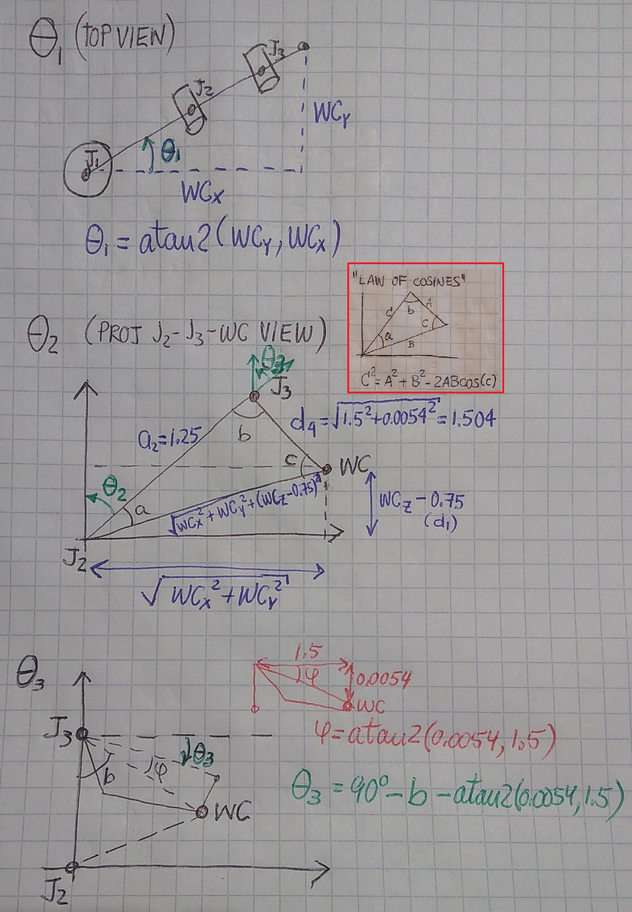

**STEP3**- The orientation of the EE is known from ROS. Need to find
joint angles 4, 5, 6 using Euler Angles from Rotation Matrix.

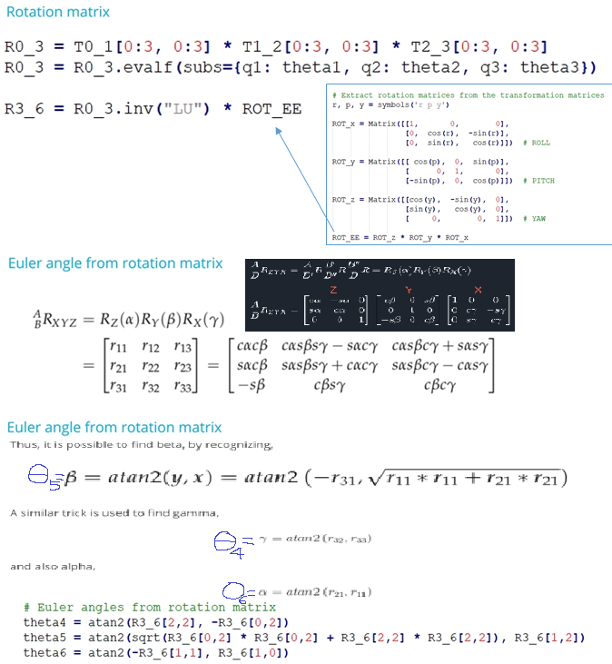


## **KINEMATICS IMPLEMENTATION** ##

Function handle\_calculate\_IK(req) under IK\_server.py performs the
inverse kinematics calculations:

```
#     Define DH param symbols
d1, d2, d3, d4, d5, d6, d7 = symbols('d1:8')  # link offset
a0, a1, a2, a3, a4, a5, a6 = symbols('a0:7')  #link length
alpha0, alpha1, alpha2, alpha3, alpha4, alpha5, alpha6 = symbols('alpha0:7')  #twist angle

#     Joint angle symbols
q1, q2, q3, q4 ,q5, q6, q7 = symbols('q1:8')

# Create Modified DH parameters
DH_Table = { alpha0:       0,  a0:      0,  d1:  0.75,  q1:          q1,
             alpha1:  -pi/2.,  a1:   0.35,  d2:     0,  q2: -pi/2. + q2,
             alpha2:       0,  a2:   1.25,  d3:     0,  q3:          q3,
             alpha3:  -pi/2.,  a3:  -.054,  d4:   1.5,  q4:          q4,
             alpha4:   pi/2.,  a4:      0,  d5:     0,  q5:          q5,
             alpha5:  -pi/2.,  a5:      0,  d6:     0,  q6:          q6,
             alpha6:       0,  a6:      0,  d7: 0.303,  q7:           0}

# Define Modified DH Transformation matrix
def TF_Matrix(alpha, a, d, q):
    TF = Matrix([[             cos(q),            -sin(q),            0,              a],
                [   sin(q)*cos(alpha),  cos(q)*cos(alpha),  -sin(alpha),  -sin(alpha)*d],
                [   sin(q)*sin(alpha),  cos(q)*sin(alpha),   cos(alpha),   cos(alpha)*d],
                [                   0,                  0,            0,              1]])
    return TF

# Create individual transformation matrices
T0_1 =  TF_Matrix(alpha0, a0, d1, q1).subs(DH_Table)
T1_2 =  TF_Matrix(alpha1, a1, d2, q2).subs(DH_Table)
T2_3 =  TF_Matrix(alpha2, a2, d3, q3).subs(DH_Table)
T3_4 =  TF_Matrix(alpha3, a3, d4, q4).subs(DH_Table)
T4_5 =  TF_Matrix(alpha4, a4, d5, q5).subs(DH_Table)
T5_6 =  TF_Matrix(alpha5, a5, d6, q6).subs(DH_Table)
T6_EE = TF_Matrix(alpha6, a6, d7, q7).subs(DH_Table)

T0_EE = T0_1 * T1_2 * T2_3 * T3_4 * T4_5 * T5_6 * T6_EE

# Extract rotation matrices from the transformation matrices
r, p, y = symbols('r p y')

ROT_x = Matrix([[1,       0,        0],
                [0,  cos(r),  -sin(r)],
                [0,  sin(r),   cos(r)]])  # ROLL

ROT_y = Matrix([[ cos(p),  0,  sin(p)],
                [      0,  1,       0],
                [-sin(p),  0,  cos(p)]])  # PITCH

ROT_z = Matrix([[cos(y),  -sin(y),  0],
                [sin(y),   cos(y),  0],
                [     0,        0,  1]])  # YAW

ROT_EE = ROT_z * ROT_y * ROT_x
###

# Initialize service response
joint_trajectory_list = []
for x in xrange(0, len(req.poses)):
    # IK code starts here
    joint_trajectory_point = JointTrajectoryPoint()

# Extract end-effector position and orientation from request
# px,py,pz = end-effector position
# roll, pitch, yaw = end-effector orientation
    px = req.poses[x].position.x
    py = req.poses[x].position.y
    pz = req.poses[x].position.z

    (roll, pitch, yaw) = tf.transformations.euler_from_quaternion(
        [req.poses[x].orientation.x, req.poses[x].orientation.y,
            req.poses[x].orientation.z, req.poses[x].orientation.w])

# Compensate for rotation discrepancy between DH parameters and Gazebo
Rot_Error = ROT_z.subs(y, radians(180)) * ROT_y.subs(p, radians(-90))

ROT_EE = ROT_EE * Rot_Error
ROT_EE = ROT_EE.subs({'r': roll, 'p': pitch, 'y': yaw})

EE = Matrix([[px],
            [py],
            [pz]])

WC = EE - (0.303) * ROT_EE[:,2]

# Calculate joint angles using Geometric IK method
theta1 = atan2(WC[1], WC[0])

# SS triangle for theta2 and theta3
side_a = 1.501
side_b = sqrt(pow((sqrt(WC[0] * WC[0] + WC[1] * WC[1]) - 0.35), 2) + pow((WC[2] - 0.75), 2))
side_c = 1.25

angle_a = acos((side_b * side_b + side_c * side_c - side_a * side_a) / (2 * side_b * side_c))
angle_b = acos((side_a * side_a + side_c * side_c - side_b * side_b) / (2 * side_a * side_c))
angle_c = acos((side_a * side_a + side_b * side_b - side_c * side_c) / (2 * side_a * side_b))

theta2 = pi / 2 - angle_a - atan2(WC[2] - 0.75, sqrt(WC[0] * WC[0] + WC[1] * WC[1]) - 0.35)
theta3 = pi / 2 - (angle_b + 0.036)  # 0.036 accounts for sag in link4 of -0.054m

# Calculation of joint angles 4,5,6
R0_3 = T0_1[0:3, 0:3] * T1_2[0:3, 0:3] * T2_3[0:3, 0:3]
R0_3 = R0_3.evalf(subs={q1: theta1, q2: theta2, q3: theta3})

R3_6 = R0_3.inv("LU") * ROT_EE

# Euler angles from rotation matrix
theta4 = atan2(R3_6[2,2], -R3_6[0,2])
theta5 = atan2(sqrt(R3_6[0,2] * R3_6[0,2] + R3_6[2,2] * R3_6[2,2]), R3_6[1,2])
theta6 = atan2(-R3_6[1,1], R3_6[1,0])
```


## **INVERSE KINEMATICS DEBUG** ##

The same code implemented on IK\_server.py is available on
RoboND-Kinematics-Project\\ IK\_debug.py for quick
testing.

Just run:

```
python IK_debug.py
```


## **RESULTS AND CONCLUSIONS** ##

The ROS model was able to perform the pick and place action by utilizing
Inverse Kinematics sent back to the ROS model for number of points
calculated for the trajectory.

A sequence of actions is shown below:

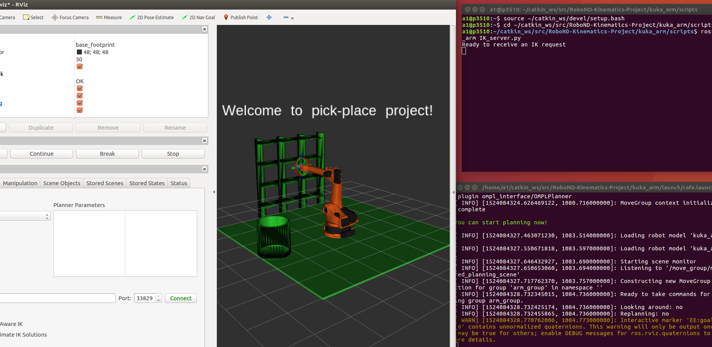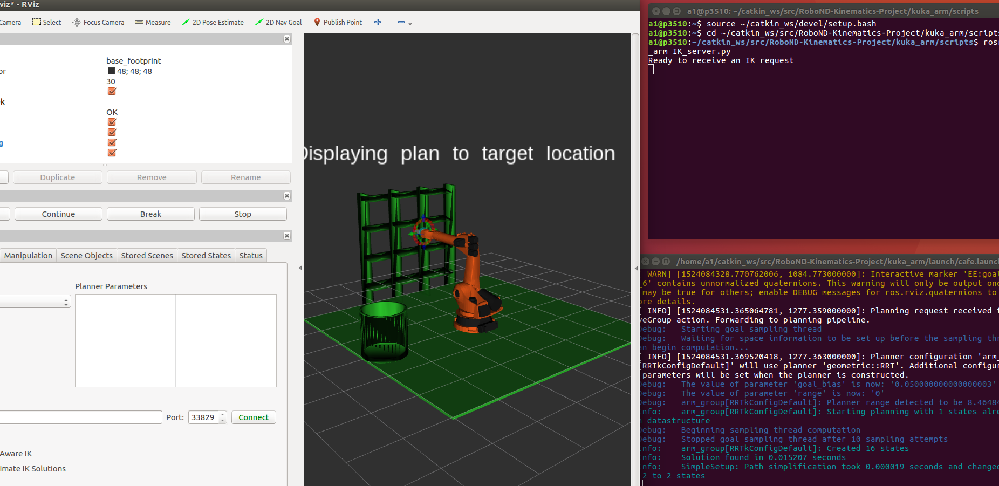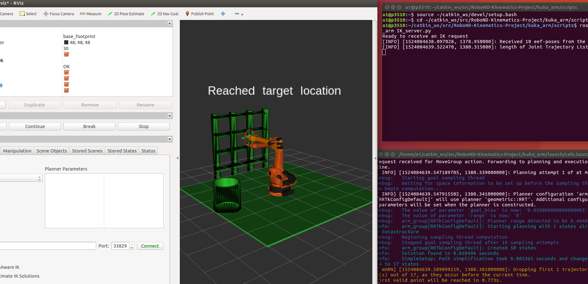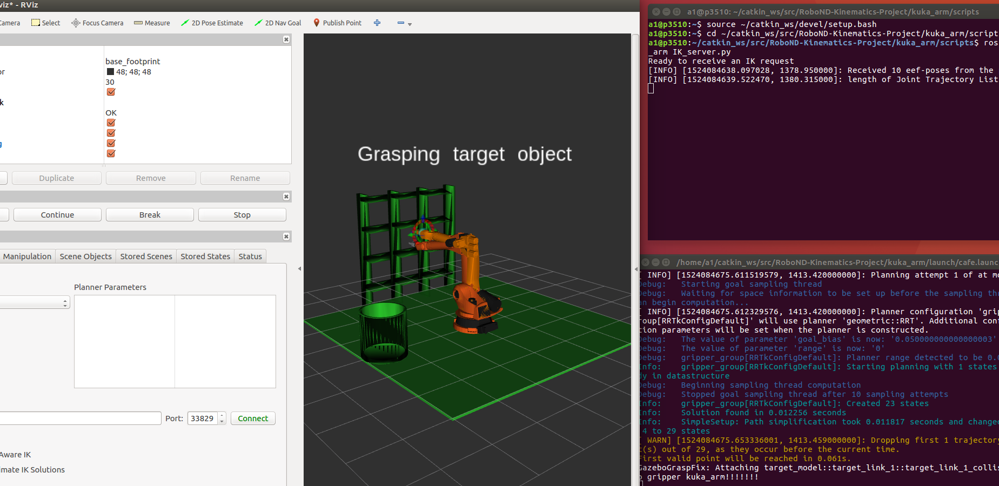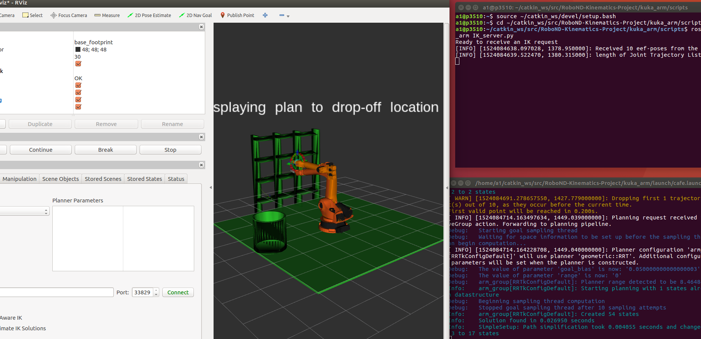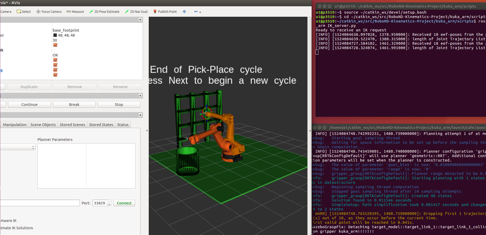
